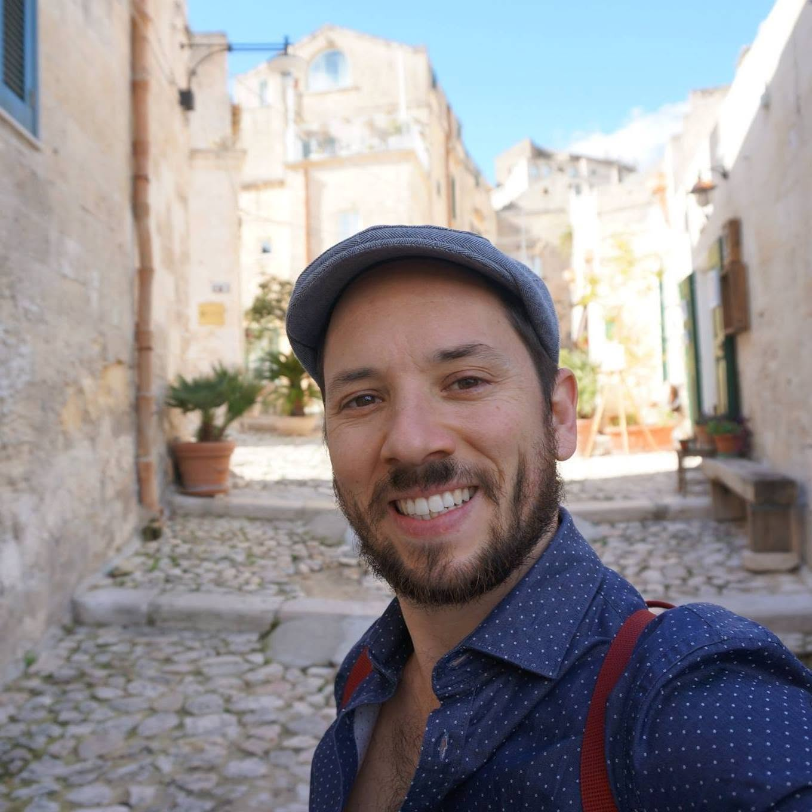
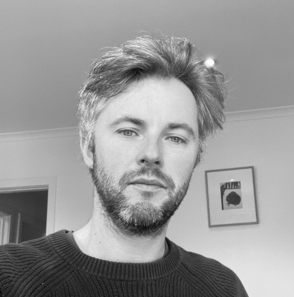
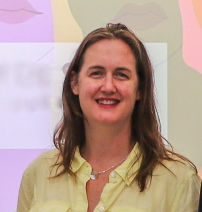
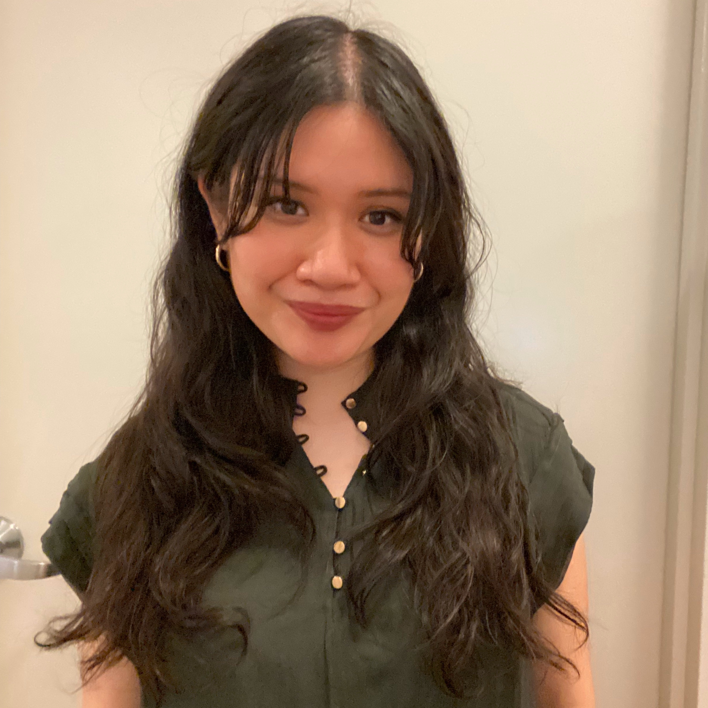
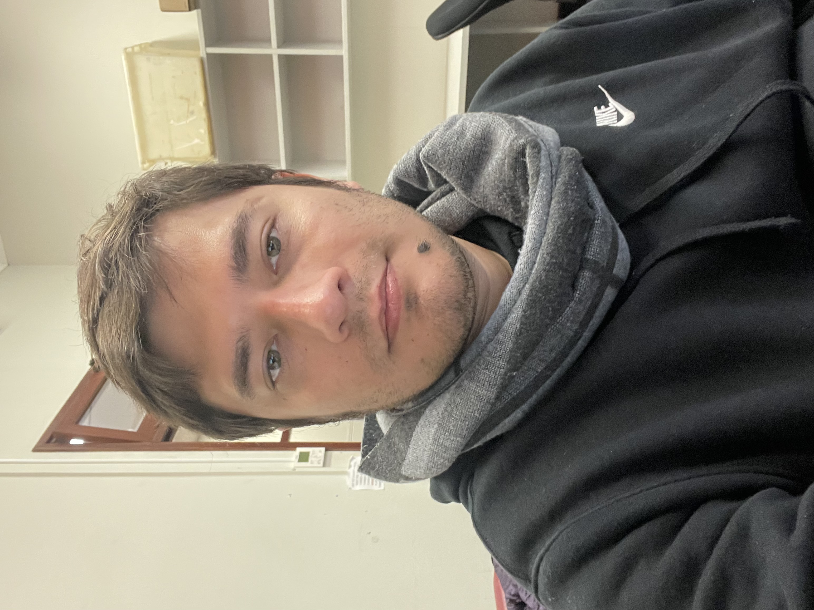
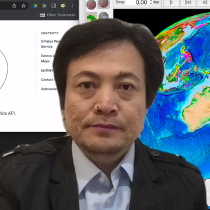

---
# =============================================================================
# contact.qmd — Contact page
# =============================================================================
title: "Contact"
---

```{=html}
<div class="people-section">

<h1>Meet the M@TE Team</h1>

<p class="people-intro">
  <strong>Model Atlas of the Earth (M@TE)</strong> is developed by an international team of
  scientists and professional software developers in the School of Geosciences at the University
  of Sydney with contributions from:
  &nbsp;The Sydney Informatics Hub, National Computational Infrastructure (NCI), and AuScope.
</p>

<div class="people-grid">

<div class="people-card">
  
  <h3>Sara Polanco</h3>
  <p class="people-title">Founder and Lead of the M@TE Team</p>
  <p class="people-orcid">ORCID: 0000-0002-1270-4377</p>
</div>

<div class="people-card">
  
  <h3>Julian Giordani</h3>
  <p class="people-title">Research Software Engineer</p>
  <p class="people-orcid">ORCID: 0000-0003-4515-9296</p>
</div>


<div class="people-card">
  
  <h3>Dan Sandiford</h3>
  <p class="people-title">Research Fellow (Earth Data and Processes)</p>
  <p class="people-orcid">ORCID: 0000-0002-2207-6837</p>
</div>

<div class="people-card">
  
  <h3>Ben Mather</h3>
  <p class="people-title">Computational Geophysicist</p>
</div>

<div class="people-card">
  
  <h3>Rebecca Farrington</h3>
  <p class="people-title">Director of Research Data Systems at AuScope</p>
  <p class="people-orcid">ORCID: 0000-0002-2594-6965</p>
</div>

<div class="people-card">
  
  <h3>Lauren Ilano</h3>
  <p class="people-title">Research Assistant and Undergraduate</p>
</div>

<div class="people-card">
  
  <h3>Chris Alfonso</h3>
  <p class="people-title">Research Assistant and PhD candidate</p>
  <p class="people-orcid">ORCID: 0009-0009-6438-2945</p>
</div>

<div class="people-card">
  
  <h3>Andres Rodriguez-Corcho</h3>
  <p class="people-title">Research Assistant</p>
  <p class="people-orcid">ORCID: 0000-0002-1521-7910</p>
</div>

<div class="people-card">
  
  <h3>Tim White</h3>
  <p class="people-title">Data Science Software Engineer</p>
</div>

<div class="people-card">
  
  <h3>Xiaodong Qin</h3>
  <p class="people-title">Developer of GPlates</p>
</div>

</div>
</div>
```

::: {.contact-section}

# Contact

## Submit a Model

M@TE accepts model submissions via GitHub. To submit your geoscientific model, open an issue in the submission repository:

👉 **[Model Submission Repository](https://github.com/ModelAtlasofTheEarth/model_submission)**

Use the structured issue template to provide metadata about your model, including:

- Model title, abstract, and description
- Creator ORCID identifiers
- Associated publication DOI
- Software used
- Research tags
- Links to model files (code, inputs, outputs)

Submissions are currently **by invitation only** as M@TE is being intentional about showcasing a diverse and representative set of models.

---

## Get in Touch

For general enquiries about M@TE, please open a GitHub Discussion or Issue in the main repository:

👉 **[ModelAtlasofTheEarth/website](https://github.com/ModelAtlasofTheEarth/website)**

---

## Community

Join the growing community of researchers building reproducible, reusable geoscientific models.
Together we make Earth science more open and accessible.

:::
